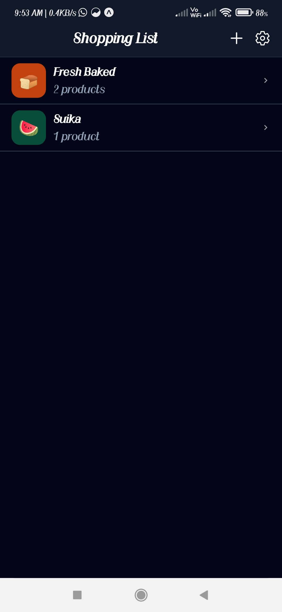
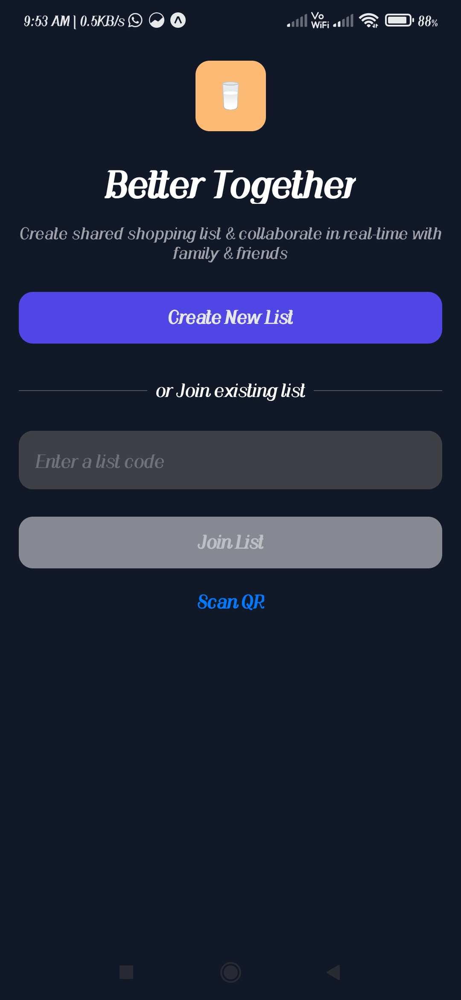
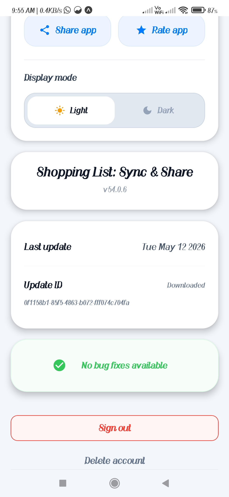

# GrocyGo - Grocery Shopping List App

A React Native application for managing grocery shopping lists, built with Expo and featuring user authentication, list sharing, and product management.

## Features

- User authentication with Clerk
- Create and manage shopping lists
- Add products to lists
- Share lists with others
- Scan products (camera integration)
- Color and emoji customization
- Offline support with SQLite
- Cross-platform (iOS, Android, Web)

## Prerequisites

- Node.js (version 18 or higher)
- npm or yarn
- Expo CLI
- For mobile development: Android Studio (for Android) or Xcode (for iOS)

## Installation

1. Clone the repository:

   ```bash
   git clone <repository-url>
   cd GroceryApp
   ```

2. Install client dependencies:

   ```bash
   cd client
   npm install
   ```

3. Install server dependencies:
   ```bash
   cd ../server
   npm install
   ```

## Setup

### Environment Variables

1. For the client, create a `.env` file in the `client` directory with your Clerk keys:

   ```
   EXPO_PUBLIC_CLERK_PUBLISHABLE_KEY=your_clerk_publishable_key
   CLERK_SECRET_KEY=your_clerk_secret_key
   ```

2. For the server, configure Cloudflare Workers if deploying, or set up local development.

### Clerk Setup

- Sign up for a Clerk account at [clerk.dev](https://clerk.dev)
- Create a new application
- Copy the publishable and secret keys to your environment variables

## Running the App

1. Start the server:

   ```bash
   cd server
   npm run dev
   ```

2. In a new terminal, start the client:

   ```bash
   cd client
   npm start
   ```

3. Follow the Expo CLI prompts to run on your desired platform:
   - Press `a` for Android emulator
   - Press `i` for iOS simulator
   - Press `w` for web

## Project Structure

- `client/`: React Native Expo app
- `server/`: Cloudflare Worker backend
- `preview/`: Screenshots and previews

## Screenshots





## Technologies Used

- React Native
- Expo
- Clerk (Authentication)
- Tinybase (Database)
- NativeWind (Styling)
- Expo Router (Navigation)

## Contributing

1. Fork the repository
2. Create a feature branch
3. Make your changes
4. Submit a pull request

## License

This project is licensed under the MIT License.
